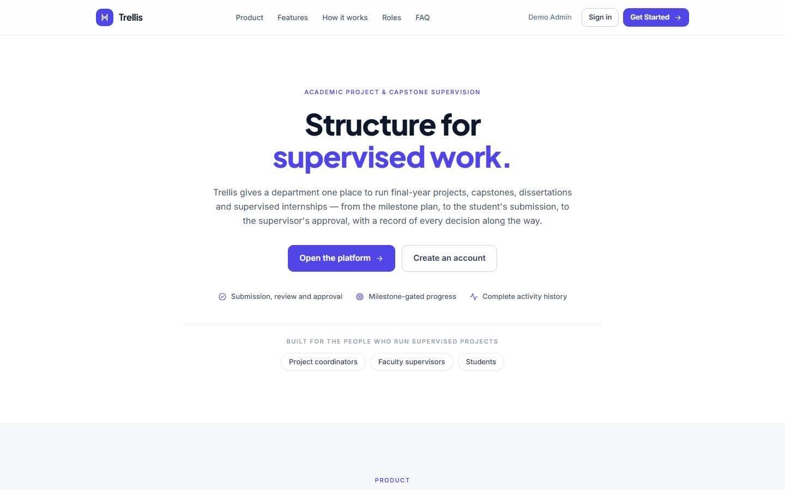
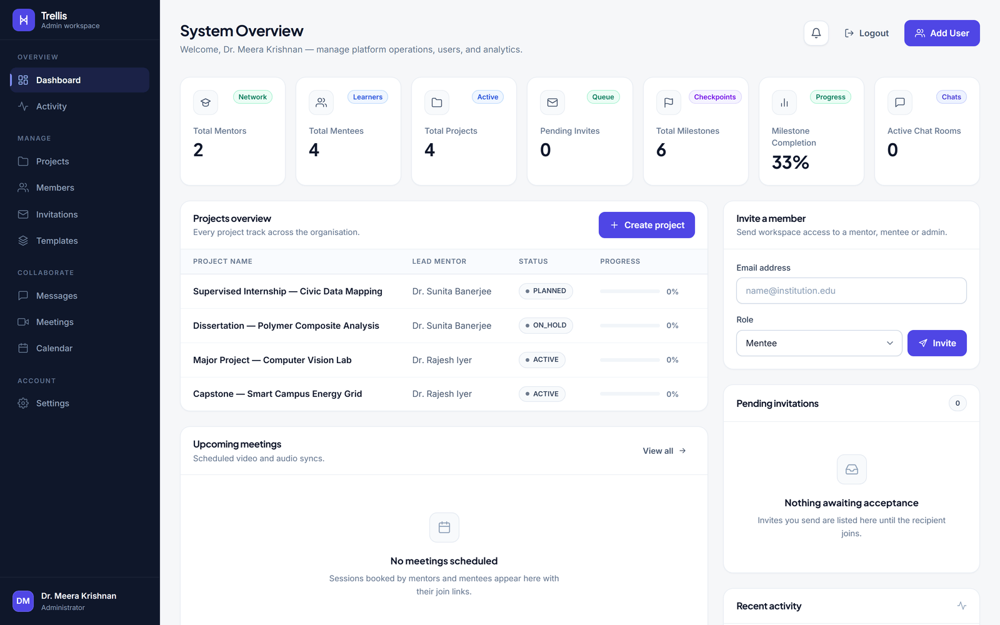
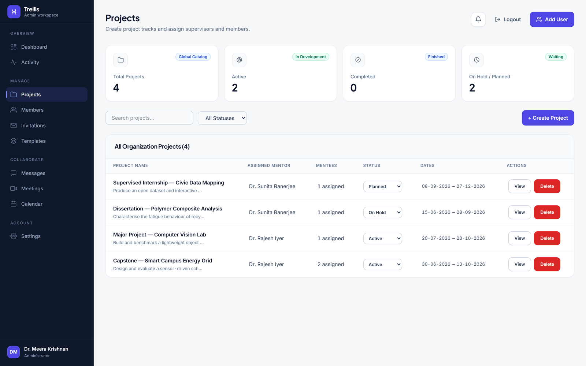
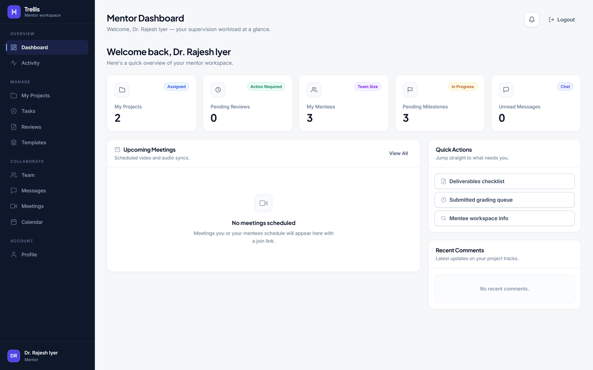
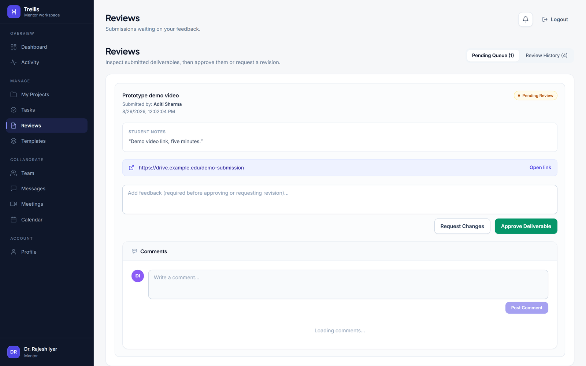
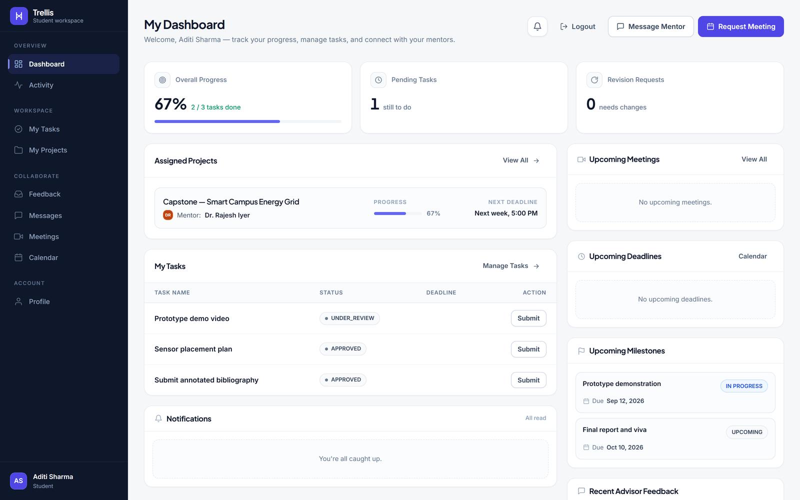
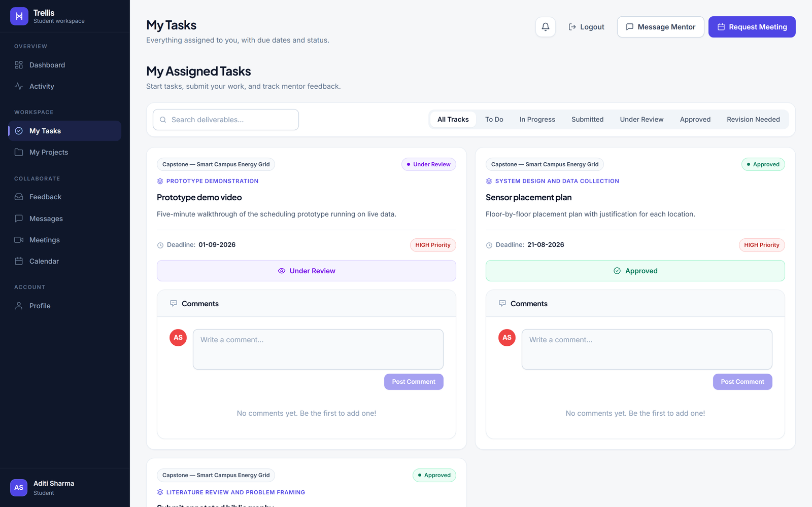
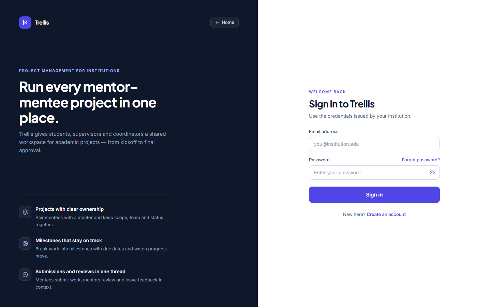
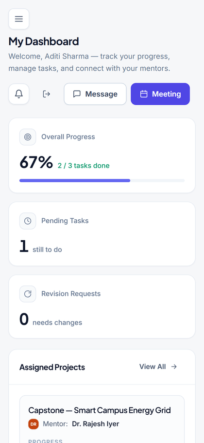

# Trellis — Frontend

React client for **Trellis**, an academic project and capstone supervision
platform.

A general task tracker ends a task at *Done*, marked by whoever was doing it.
Trellis puts a **review gate** in the middle: a student submits, the task moves
to *Under review*, and a supervisor either approves it or returns it with written
feedback. The interface is built around that loop.

There are three workspaces — coordinator, supervisor and student — each with its
own navigation, dashboard and permissions.

> **Backend:** [Mentor-Mentee-Backend](https://github.com/The-Debug-Squad-BITS/Mentor-Mentee-Backend) — the Express API this client consumes. You need it running.



---

## Contents

1. [Screens](#screens)
2. [Technology stack](#technology-stack)
3. [Getting started](#getting-started)
4. [Configuration](#configuration)
5. [Project structure](#project-structure)
6. [Routing and access control](#routing-and-access-control)
7. [Using the app](#using-the-app)
8. [Design system](#design-system)
9. [State management](#state-management)
10. [API and real-time integration](#api-and-real-time-integration)
11. [Performance](#performance)
12. [SEO and accessibility](#seo-and-accessibility)
13. [Available scripts](#available-scripts)
14. [Deployment notes](#deployment-notes)

---

## Screens

<table>
<tr>
<td width="50%"><b>Coordinator — dashboard</b><br></td>
<td width="50%"><b>Coordinator — projects</b><br></td>
</tr>
<tr>
<td><b>Supervisor — dashboard</b><br></td>
<td><b>Supervisor — review queue</b><br></td>
</tr>
<tr>
<td><b>Student — dashboard</b><br></td>
<td><b>Student — my tasks</b><br></td>
</tr>
</table>

<p align="center">
  
  &nbsp;
  
</p>

*All screenshots show demo data.*

---

## Technology stack

| Concern | Choice | Version |
|---|---|---|
| Framework | React | `^19.2.6` |
| Build tool | Vite | `^8.0.12` |
| Styling | Tailwind CSS | `^4.3.0` |
| Routing | react-router-dom | `^7.15.1` |
| State | Zustand | `^5.0.14` |
| HTTP | axios | `^1.18.0` |
| Real time | socket.io-client | `^4.8.3` |
| Notifications | react-toastify | `^11.1.0` |
| Linting | ESLint | `^10.3.0` |

---

## Getting started

### Prerequisites

- **Node.js 20+** and npm
- The **Trellis backend** running and reachable

### Installation

```bash
git clone https://github.com/The-Debug-Squad-BITS/Mentor-Mentee.git
cd Mentor-Mentee
npm install
cp .env.example .env      # then adjust if your API is not on localhost:5000
npm run dev
```

The dev server starts on <http://localhost:5173>.

> **Port matters.** The backend allows browser requests only from the origin in
> its `CLIENT_URL`. If you run this client on a different port, set `CLIENT_URL`
> on the backend to match, or the browser will block every API call as a CORS
> error.

### First run

There is no seeded account. Open the app and choose **Create an account** to
register an organisation and become its coordinator. From there, invite
supervisors and students through **Members → Invite User**; each receives a
temporary password by email.

---

## Configuration

Environment variables are read at **build time** and are baked into the bundle.
Anything prefixed `VITE_` is visible to anyone who loads the site — never put a
secret in one.

| Variable | Default | Purpose |
|---|---|---|
| `VITE_API_URL` | `http://localhost:5000/api` | Base URL of the REST API |
| `VITE_SOCKET_URL` | `http://localhost:5000` | Socket.io server origin |
| `VITE_SITE_URL` | placeholder | Public origin, used for canonical links, Open Graph tags and `sitemap.xml` |

Set `VITE_SITE_URL` in your hosting platform's build environment when you deploy.
A local `.env` is gitignored and will not reach the deployment.

---

## Project structure

```
├── index.html              Document head: metadata, Open Graph, JSON-LD
├── vite.config.js          Vendor chunking; emits robots.txt and sitemap.xml
├── public/                 favicon.svg, favicon.png
├── docs/screenshots/       Images used by this README
└── src/
    ├── App.jsx             Router, route guards, error boundary, Suspense
    ├── main.jsx            Entry point
    ├── index.css           Design tokens and component classes
    ├── pages/              Route components
    ├── components/
    │   ├── ui/             Primitives: Brand, Button, Avatar, Icons, StatusBadge,
    │   │                   ProgressBar, ErrorBoundary, RouteLoader, NotificationBell
    │   ├── layout/         Marketing header and footer
    │   ├── sections/       Landing-page sections
    │   ├── login/          Authentication panels
    │   ├── admin/          Coordinator workspace
    │   ├── mentor/         Supervisor workspace
    │   ├── mentee/         Student workspace
    │   ├── chat/           Messaging
    │   ├── meetings/       Meeting scheduling
    │   └── calendar/       Shared calendar
    ├── store/              Zustand stores
    ├── hooks/              useSeo
    └── lib/                api, socket, seo, pageMeta, datetime, avatarColor
```

---

## Routing and access control

| Route | Guard | Screen |
|---|---|---|
| `/` | Public | Landing page |
| `/login` | Public only | Sign in |
| `/signup` | Public only | Create a workspace |
| `/change-password` | Authenticated | Forced password change |
| `/admin/dashboard` | `ADMIN` | Coordinator workspace |
| `/mentor/dashboard` | `MENTOR` | Supervisor workspace |
| `/mentee/dashboard` | `MENTEE` | Student workspace |
| `/unauthorized` | — | Access denied |
| `*` | — | Redirects to `/` |

Three guards enforce this:

- **`ProtectedRoute`** — redirects to `/login` without a session, and to
  `/unauthorized` when the role is not permitted.
- **`PublicOnlyRoute`** — sends a signed-in user away from `/login` and
  `/signup` to their own dashboard.
- **Temporary-password gate** — a user flagged `mustChangePassword` is held at
  `/change-password` until they set a real password.

Inside a dashboard, sections are switched by local state rather than nested
routes, so the sidebar does not remount the shell on every change.

---

## Using the app

### Coordinator

Runs the department workspace. Invites members, creates projects, assigns a
supervisor and students to each, builds reusable project templates, and reads
the organisation-wide activity log.

### Supervisor

Runs the review queue. Creates milestones and tasks on assigned projects,
inspects submitted deliverables, and either approves them or requests changes
with written feedback. Feedback is required before either decision.

### Student

Sees only their own work. Moves their tasks through the board, submits
deliverables as a file or a link, and reads supervisor feedback on each.

All three share messaging, meetings, a calendar and a notification bell that
updates live.

---

## Design system

One accent colour, one type scale, defined as tokens in `src/index.css`:

- **Brand** — indigo, `--color-brand-50` through `--color-brand-950`
- **Neutrals** — a slightly blue-shifted slate ramp
- **Status colours** — semantic only, never decorative

Component classes (`.card`, `.btn`, `.input`, `.badge-*`) are composed from those
tokens, so a change to a token propagates everywhere. The Trellis mark and
wordmark live in `src/components/ui/Brand.jsx`; nothing else draws them.

---

## State management

Zustand, one store per domain. Stores hold server data and the flags that
describe its loading and error state; components stay presentational.

Auth state persists to `localStorage` so a reload keeps the session. Everything
else is fetched on mount, which keeps the client honest about what the server
actually holds.

---

## API and real-time integration

`src/lib/api.js` wraps axios with the base URL, a request timeout, an
`Authorization` header attached from the persisted session, and an error
normaliser that turns any failure into a readable `userMessage`.

`src/lib/socket.js` connects to Socket.io with the same token on the handshake.
Notifications and chat messages arrive over the socket and update the relevant
store directly.

> Marking **all** notifications read is a socket event (`mark_all_read`), not a
> REST call — the API has no bulk endpoint for it.

---

## Performance

- **Routes are lazily loaded.** Each workspace is a separate chunk, so a visitor
  to the landing page never downloads the three dashboards.
- **Vendor code is split by change frequency** — React, real-time and UI
  libraries chunk separately, so an application update does not invalidate them.
- **Skeletons rather than spinners** while data loads, so layout does not shift.
- **An error boundary** wraps the router; a render failure shows a recovery
  screen instead of a blank page.

Initial payload is roughly **116 KB of JavaScript and 16 KB of CSS, gzipped**.

---

## SEO and accessibility

`index.html` carries the canonical link, Open Graph and Twitter tags, and
JSON-LD describing the organisation and the software. `vite.config.js` emits
`robots.txt` and `sitemap.xml` at build time. Authenticated routes are marked
`noindex` — dashboards should not be in a search index.

The interface is keyboard navigable with visible focus rings, uses semantic
landmarks, labels its icon-only controls, and meets 4.5:1 contrast for body text.
Layouts are verified at 390 px, 834 px and 1440 px.

---

## Available scripts

| Script | Purpose |
|---|---|
| `npm run dev` | Start the dev server with hot module replacement |
| `npm run build` | Production build to `dist/` |
| `npm run preview` | Serve the production build locally |
| `npm run lint` | Run ESLint |

---

## Deployment notes

- Build with `VITE_API_URL`, `VITE_SOCKET_URL` and `VITE_SITE_URL` set in the
  hosting platform's environment — they are read at build time, not runtime.
- Set the backend's `CLIENT_URL` to the deployed frontend origin, or CORS will
  block every request.
- Serve as a single-page app: rewrite unknown paths to `index.html`, otherwise a
  refresh on `/admin/dashboard` returns a 404.

---

## Licence

Released for academic assessment. Built as a final-year project at BITS Pilani.
